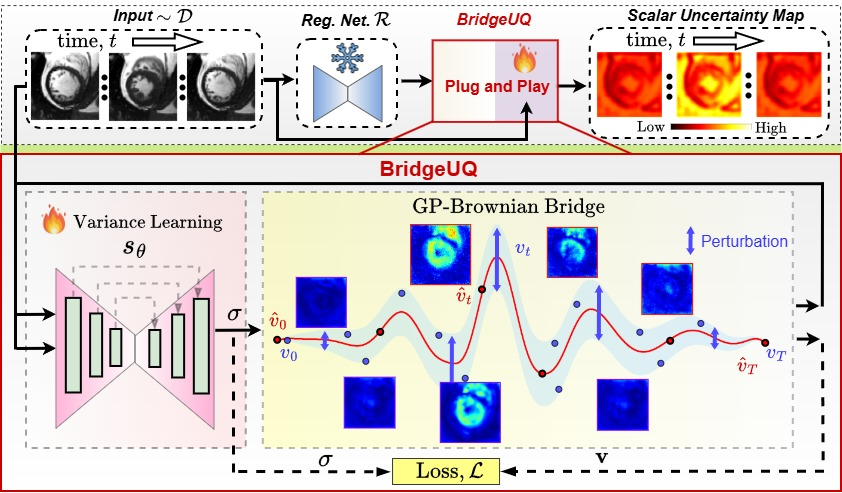

# BridgeUQ: Bayesian Aleatoric Uncertainty Quantification For Time-Series Medical Image Registration via Brownian Bridge Prior

This paper presents {\em BridgeUQ}, a novel Bayesian framework for aleatoric uncertainty quantification in pretrained deterministic registration models. In contrast to previous approaches that mainly focus on pairwise registration, our work is the first to model posterior uncertainty over spatiotemporal deformation trajectories that captures the intrinsic ambiguity of registration solutions across both space and time. To achieve this, we first introduce a novel hierarchical Gaussian process prior in the temporal deformation space, based on a Brownian bridge formulation with an inverse-Gamma hyper prior on the diffusion variance, to govern stochastic sampling around the predicted registration solution. We then define an energy-based likelihood function derived from the pretrained registration objective to ensure the sampled deformations remain faithful to the observed data. To facilitate efficient inference, we further develop an amortized maximum-a-posterior (MAP) scheme combined with conditional diffusion sampling to approximate this resulting posterior. It is important to note that BridgeUQ is a plug-and-play module that can be seamlessly integrated with arbitrary pretrained registration models without retraining. We validate BridgeUQ on widely used registration networks using comprehensive cardiac and brain magnetic resonance imaging datasets. Experimental results show that our approach is able to produce well-calibrated uncertainty estimates for a variety of learning-based registration models. The proposed BridgeUQ provides a practical and principled pathway toward uncertainty-aware and safety-critical medical image registration.
---

## Our Approach



## Directory contents

| File | Purpose |
|------|---------|
| `main.py` | Contain the uncertainty estimatio code for the BridgeUQ. Given the backbone, this compute the uncertainty. |
| `trainer.py` | Contain code for the variance learning. |
| `brownian_bridge.py` | Contain code realated to Brownian-bridge. |
| `networks.py` | Variance learning network. |
| `losses.py` | Contain code for the optimization objective. |
| `warping.py` | Velocity-field warping via grid_sample. |
| `visualization.py` | Contain visualization code. |

---

## Quick start

```bash
python -m uncertainty_brain_sde_v3.main --backbone tlrn
```

Common flags:

```
--backbone {tlrn,ltma,tm,voxelmorph}    pretrained registration model (default: tlrn)
--batch_size INT                         minibatch size
--num_train_samples INT                  N reverse-SDE trajectories per inner iter (default: 100)
--loss {mse,ncc,ssim,...}                similarity term inside the energy
--mixed_precision / --no_mixed_precision fp16 autocast for activations (SDE coeffs stay fp32)
--dataset {mni88,full}                   
```


## Key hyperparameters (top of `main.py`)

| Name | Default | Meaning |
|------|---------|---------|
| `INNER_ITERATIONS` | 1000 | K test-time training iterations per minibatch |
| `NUM_RUNS` | 100 | number of UQ samples per subject |
| `LAMBDA` / `ALPHA` | 3 / 1e-4 | inverse-Gamma prior on σ |

---

## License

Research / academic use only.
